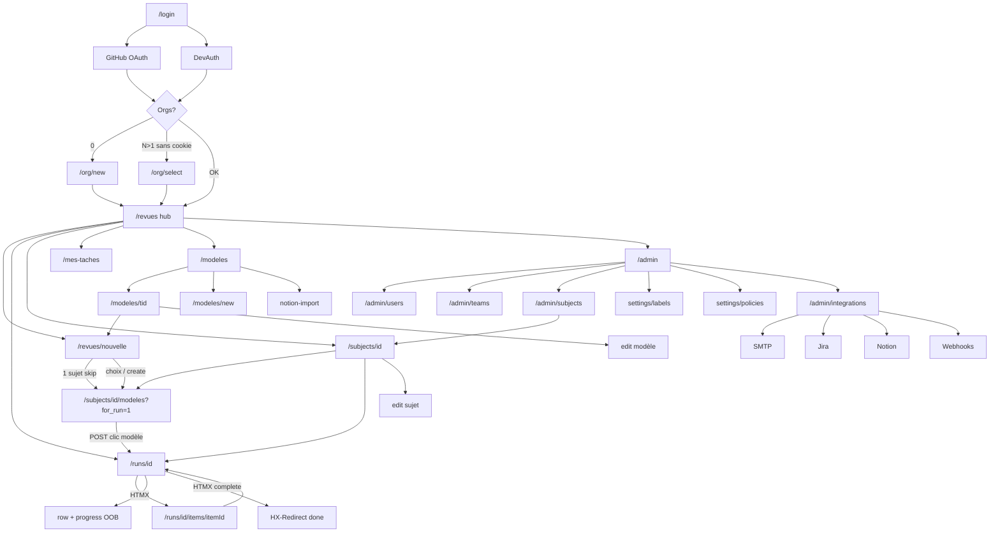

# Inventaire écrans & interactions — Revues

**Date** : 2026-07-19  
**Scope** : app authentifiée + admin org + auth/onboarding (read-only Wave 1)  
**Sources** : `internal/web/router.go`, `web/templates/**`, `site_nav.html`, `admin_nav.html`, `breadcrumbs.go`, `decisions.md`  
**Hors inventaire UI** : `GET /healthz`, `GET /sw.js`, `GET /static/*` (infra)

---

## 1. Carte des écrans (liste)

Légende entrées : **Nav** = `site_nav` ; **Org** = onglet/lien Organisation ou `admin_nav` ; **Header** = switcher org / DevAuth / compte ; **Deep** = URL directe / breadcrumb / lien métier ; **Wizard** = parcours lancer revue.

| Path pattern | Template | H1 / title intent | Entrée(s) | Sortie(s) principales |
|---|---|---|---|---|
| `GET /` | `home` (anon) ; redirect `/revues` si session | « Revues » (landing) | URL racine, post-logout indirect | → `/login` ; connecté → `/revues` |
| `GET /login` | `login` | Connexion | Header « Connexion », redirect auth | GitHub OAuth **ou** DevAuth → app ; erreurs query |
| `GET /auth/github/start` | — (redirect) | — | CTA login | GitHub → callback |
| `GET /auth/github/callback` | — (redirect) | — | OAuth | `/revues` / `/org/new` / `/org/select` |
| `POST /auth/dev/login` | — (redirect) | — | Login DevAuth + header switcher | `next` safe (`/revues`, `/mes-taches`, `/subjects`) |
| `POST /logout` | — (redirect) | — | Header Déconnexion | → `/login` |
| `GET /org/new` | `org_new` | Nouvelle organisation | Post-login 0 org | POST create → `/revues` |
| `POST /org/new` | — | — | Formulaire | → `/revues` |
| `GET /org/select` | `org_select` | Choisir une organisation | Post-login multi-org sans cookie | POST → `/revues` |
| `POST /org/select` | — | — | Formulaire | → `/revues` |
| `POST /org/switch` | — | — | Header switcher (≥2 orgs) | recharge page / `/revues` |
| `POST /org/invitations/{id}/accept` | — | — | Banner invitations | → `/revues` |
| `GET /revues` | `runs_list` | Labels.Run.Nav (hub) | **Nav** principal ; post-login | Wizard, fiche run, sujet (colonne), admin users (empty), mes tâches, pagination |
| `GET /revues/nouvelle` | `run_wizard_subjects` | CTA lancer (étape 1) | CTA `/revues`, template « Lancer… », empty states | Sujet → `/subjects/{id}/modeles?for_run=1` ; 1 sujet = skip auto ; POST créer sujet |
| `POST /revues/nouvelle` | — | — | Form « Créer et continuer » | → picker modèles `for_run=1` |
| `GET /runs/{id}` | `run_show` | Titre revue (sans `#id` ; SimpleUI sans sujet) | Liste revues, sujet, tâches, redirect create | Items HTMX, clôture, CSV/preuve/Notion, item détails, sujet |
| `GET /runs/{id}/export.csv` | — (fichier) | — | CTA revue `done` | Download |
| `GET /runs/{id}/export/preuve.zip` | — (fichier) | — | CTA si `CanExportEvidence` | Download |
| `POST /runs/{id}/export/notion` | — | — | CTA si Notion config + droits | Redirect fiche |
| `POST /runs/{id}/start` | — | — | Legacy `draft` | → `in_progress` |
| `POST /runs/{id}/complete` | HTMX / redirect | — | Form clôture | `HX-Redirect` ou redirect fiche `done` |
| `GET /runs/{id}/items/{itemId}` | `run_item_show` | Label point | Lien « Détails », NOK, mes tâches | Jira, PJ, historique → retour revue |
| `POST /runs/{id}/items/{itemId}` | `run_item_row_fragment` (+ OOB) | — | HTMX statut/commentaire | Row + progress + complete status |
| `POST /runs/{id}/items/{itemId}/assign` | idem | — | HTMX assign | Row swap |
| `POST /runs/{id}/items/{itemId}/jira-link` | — | — | Formulaire fiche point | Redirect fiche point |
| `POST /runs/{id}/items/{itemId}/jira-create` | — | — | Formulaire si NOK | Redirect fiche point |
| `POST /runs/{id}/items/{itemId}/attachment` | page / redirect | — | Formulaire PJ (hx + classic) | Redirect fiche point |
| `GET /attachments/{id}` | — (fichier) | — | Thumb / PDF | Download / inline image |
| `GET /mes-taches` | `my_tasks` | Mes tâches | **Nav** si `ShowMyTasks` | Fiche point / revue |
| `GET /subjects` | `subjects_list` | Labels.Subject.Plural | **Deep** (hors nav org classique) ; home.html dead branch | Fiche sujet, create |
| `GET /subjects/new` | `subject_form` | Nouveau {sujet} | Empty SimpleUI, deep | POST → fiche `/subjects/{id}` |
| `POST /subjects` | — | — | Form create | → `/subjects/{id}` |
| `GET /subjects/{id}` | `subject_show` | Nom sujet | Colonne revues, admin list, wizard crumbs, retour run | Lancer (picker), edit, runs, collab (si `ShowCollab`) |
| `GET /subjects/{id}/edit` | `subject_form` | Modifier | CTA fiche (non admin org) | Update / archive → liste `/subjects` |
| `POST /subjects/{id}` | — | — | Form | Redirect fiche ou liste |
| `POST /subjects/{id}/archive` | — | — | Danger zone | → `/subjects` |
| `GET /subjects/{id}/teams/preview` | `subject_team_preview_fragment` | — | HTMX change équipe | Fragment preview |
| `POST /subjects/{id}/teams` | — | — | Form collab | → fiche sujet |
| `POST /subjects/{id}/teams/remove` | — | — | Retirer équipe | → fiche |
| `POST /subjects/{id}/members` | — | — | Inviter | → fiche |
| `POST /subjects/{id}/members/remove` | — | — | Retirer | → fiche |
| `GET /subjects/{id}/modeles` | `checklist_templates_list` | Modèles / Listes (sujet) | Wizard étape 2 (`for_run=1`) ; deep sans `for_run` | POST create run **ou** lien `/modeles/{tid}` |
| `POST /subjects/{id}/revues` | — | — | Clic modèle en mode `for_run` | → `/runs/{id}` (`in_progress`) |
| `GET /modeles` | `templates_index` | Modèles / Listes | **Nav** (éditeur+ ; SimpleUI « Listes ») | Fiche modèle, new, Notion import |
| `GET /modeles/new` | `checklist_template_form` | Nouveau / Nouvelle | Toolbar create | POST → `/modeles/{tid}` |
| `POST /modeles` | — | — | Form create | → show |
| `GET /modeles/notion-import` | `checklist_template_notion_import` | Importer depuis Notion | Toolbar (non SimpleUI + Notion) | Wizard 3 steps → show |
| `POST /modeles/notion-import` | idem / redirect | — | Steps fetch/preview/import | → `/modeles/{tid}` |
| `GET /modeles/{tid}` | `checklist_template_show` | Nom modèle/liste | Index, picker lecture | Lancer wizard `?template=`, edit |
| `GET /modeles/{tid}/edit` | `checklist_template_form` | Modifier | CTA show | Save / archive |
| `POST /modeles/{tid}` | — | — | Form save (nouvelle version) | → show |
| `POST /modeles/{tid}/archive` | — | — | Danger zone | → `/modeles` |
| `GET /admin` | `admin_org_hub` | Organisation | **Nav** `ShowOrganisationNav` ; header ghost solo | Sous-pages admin |
| `GET /admin/users` | `admin_users` | Emails autorisés | Hub, empty runs, **Org** | Add / remove whitelist |
| `POST /admin/users` | — | — | Form | Redirect list |
| `POST /admin/users/remove` | — | — | Retirer | Redirect list |
| `GET /admin/teams` | `admin_teams` | Équipes | Hub / admin_nav | Créer, détail |
| `POST /admin/teams` | — | — | Form | Redirect list |
| `GET /admin/teams/{id}` | `admin_team_detail` | Nom équipe | Liste équipes | Add/remove members |
| `POST /admin/teams/{id}/members` | — | — | Form | Redirect detail |
| `POST /admin/teams/{id}/members/remove` | — | — | Retirer | Redirect detail |
| `GET /admin/subjects` | `subjects_list` (+ admin_nav) | Labels.Subject.Plural | Hub / admin_nav | Fiche `/subjects/{id}`, create admin |
| `GET /admin/subjects/new` | `subject_form` | Nouveau {sujet} | Toolbar admin | POST → fiche métier |
| `POST /admin/subjects` | — | — | Form | → `/subjects/{id}` |
| `GET /admin/subjects/{id}/edit` | `subject_form` | Modifier | CTA fiche (admin org) | Update → `/admin/subjects` ; archive |
| `POST /admin/subjects/{id}` | — | — | Form | → `/admin/subjects` |
| `POST /admin/subjects/{id}/archive` | — | — | Danger | → `/admin/subjects` |
| `GET /admin/settings/labels` | `admin_subject_labels` | Libellé {sujet} | Hub / admin_nav | POST presets sujet + run |
| `POST /admin/settings/labels` | — | — | Form | Redirect |
| `GET /admin/settings/policies` | `admin_lead_policies` | Politiques | Hub / admin_nav | POST checkboxes leads |
| `POST /admin/settings/policies` | — | — | Form | Redirect |
| `GET /admin/integrations` | `admin_integrations` | Intégrations (BC « Admin ») | Hub / admin_nav | Liens SMTP/Jira/Notion/Webhooks |
| `GET /admin/settings/smtp` | `admin_smtp` | SMTP | Integrations | Save + test email |
| `POST /admin/settings/smtp` | — | — | `action=save\|test` | Redirect |
| `GET /admin/settings/webhooks` | `admin_webhooks` | Webhooks | Integrations | Save + test |
| `POST /admin/settings/webhooks` | — | — | `action=save\|test` | Redirect |
| `GET /admin/integrations/jira` | `admin_jira` | Jira | Integrations | Save + test |
| `POST /admin/integrations/jira` | — | — | `action=save\|test` | Redirect |
| `GET /admin/integrations/notion` | `admin_notion` | Notion | Integrations | Save + test |
| `POST /admin/integrations/notion` | — | — | `action=save\|test` | Redirect |

### Chrome global (toutes pages layout)

| Élément | Visible si | Action |
|---|---|---|
| `site_nav` | Session + org | Voir §2 / SimpleUI vs org |
| Org switcher | ≥2 orgs | `POST /org/switch` |
| Lien header « Organisation » | `CanManageOrgUsers` && !`ShowOrganisationNav` && !`SimpleUI` | → `/admin` |
| DevAuth user switcher | `DevAuth` + users seed | `POST /auth/dev/login` |
| Déconnexion | Session | `POST /logout` |
| Banner invitations | Pending invites | `POST /org/invitations/{id}/accept` |
| Fil d'Ariane | ≥2 crumbs | Ancêtres seulement ; courant = H1 |

---

## 2. Graphe de liens (compact)

### Adjacence hubs → enfants

| Hub | Enfants / suites |
|---|---|
| `/revues` | `/revues/nouvelle` → wizard ; `/runs/{id}` ; `/subjects/{id}` (colonne) ; empty → `/admin/users`, `/subjects/new`, `/mes-taches` |
| Wizard 2-step | (1) sujet `/revues/nouvelle` **ou** skip si 1 sujet ; (2) `/subjects/{id}/modeles?for_run=1` — **clic = POST create** (pas d’étape titre) |
| `/modeles` | `/modeles/new`, `/modeles/{tid}`, `/modeles/notion-import` ; CTA lancer → wizard `?template=` |
| `/subjects/{id}` | `modeles?for_run=1`, runs, edit, collab HTMX preview |
| `/runs/{id}` | HTMX items ; complete OOB/redirect ; satellite item ; exports |
| `/admin` | users, teams, subjects, labels, policies, integrations → smtp/webhooks/jira/notion |

### Régions HTMX (aperçu)

| Région | Swap |
|---|---|
| `#run-item-{id}` | `outerHTML` row |
| `#run-progress` | OOB after item update |
| `#complete-section-status` | OOB NOK list |
| `#complete-section` | complete form → redirect |
| `#team-assign-preview` | preview équipe |
| card PJ (item show) | `hx-post` attachment (handler redirect) |

---

## 3. Inventaire d'interactions par écran

### Auth & onboarding

#### `/login` — `login`

| Élément | Type | Action | Données |
|---|---|---|---|
| Se connecter avec GitHub | primary | GET `/auth/github/start` | session OAuth |
| Entrer comme admin démo | primary (DevAuth) | GET `/revues` (auto-session middleware) | session démo |
| Se connecter en tant que {user} | secondary (DevAuth) | POST `/auth/dev/login` | session user_id |
| Message `.LoginError` | — | affichage | — |

#### `/org/new` — `org_new`

| Élément | Type | Action | Données |
|---|---|---|---|
| Nom / slug | form | POST `/org/new` | organizations |
| Créer l'organisation | primary | submit | org + membership owner |

#### `/org/select` — `org_select`

| Élément | Type | Action | Données |
|---|---|---|---|
| Radio org | form | POST `/org/select` | cookie org active |
| Continuer | primary | submit | — |

### Hub revues

#### `/revues` — `runs_list`

| Élément | Type | Action | Données |
|---|---|---|---|
| Recherche `q` + Filtrer | form GET | `/revues?q=&status=` | filtre liste |
| Onglets Tous / En cours / Terminées | nav tabs | `?status=` | filtre statut |
| Effacer | secondary | `/revues` | reset |
| Lancer une revue (toolbar / empty) | primary | `/revues/nouvelle` | — |
| Lien titre run | deep | `/runs/{id}` | — |
| Lien sujet (si `ShowSubjectColumn`) | deep | `/subjects/{id}` | — |
| Pagination | secondary | `?page=` | — |
| Empty: Gérer emails | primary/secondary | `/admin/users` | — |
| Empty SimpleUI: Nouveau sujet | primary | `/subjects/new` | — |
| Empty: Voir mes tâches | primary/secondary | `/mes-taches` | — |

#### `/revues/nouvelle` — `run_wizard_subjects` (wizard étape 1)

| Élément | Type | Action | Données |
|---|---|---|---|
| Recherche sujets | form GET | `/revues/nouvelle?q=&template=` | filtre |
| Lien sujet | nav/wizard | `/subjects/{id}/modeles?for_run=1[&template=]` | — |
| Créer et continuer | primary form | POST `/revues/nouvelle` | subject (+ domains) |
| Effacer filtre | secondary | wizard path | — |

*Note handler* : 1 seul sujet lançable + pas de `q` → redirect auto étape 2.

### Fiche revue & points

#### `/runs/{id}` — `run_show`

| Élément | Type | Action | Données |
|---|---|---|---|
| Filtres section / statut | form GET | `/runs/{id}?section=&status=` | vue items |
| Select statut item | HTMX | POST `.../items/{itemId}` | run_items.status |
| Textarea commentaire | HTMX (blur / Ctrl+Enter) | idem | run_items.comment |
| Select assigné (`ShowAssign`) | HTMX | POST `.../assign` | run_items.assigned_to |
| Lien Détails | deep | `/runs/{id}/items/{itemId}` | — |
| Collapse section (JS) | secondary | toggle CSS | — |
| Démarrer (legacy draft) | primary form | POST `/start` | run.status |
| Note + Terminer la revue | primary HTMX + confirm | POST `/complete` | run done + closing_note |
| Exporter CSV | secondary | GET export.csv | — |
| Télécharger la preuve | secondary | GET preuve.zip | evidence zip |
| Exporter vers Notion | secondary form | POST export/notion | Notion page + run.notion_url |
| Voir dans Notion | secondary | URL externe | — |
| Retour au sujet | secondary | `/subjects/{id}` | — |
| Lancer une autre revue | secondary | `modeles?for_run=1` | — |
| Liens NOK post-clôture | deep | fiche item | — |

#### `/runs/{id}/items/{itemId}` — `run_item_show`

| Élément | Type | Action | Données |
|---|---|---|---|
| Lien sujet / revue | nav | show subject / run | — |
| Lier / MAJ issue Jira | form secondary | POST jira-link | external_links |
| Créer ticket Jira (NOK) | form secondary | POST jira-create | Jira + link |
| Upload / remplacer PJ | form HTMX+POST | POST attachment | attachments |
| Thumb / PDF | deep | GET `/attachments/{id}` | fichier |
| Retour à la revue | secondary | `/runs/{id}` | — |
| Timeline événements | — | lecture | item_events |

### Sujets

#### `/subjects` et `/admin/subjects` — `subjects_list`

| Élément | Type | Action | Données |
|---|---|---|---|
| admin_nav (admin only) | nav | sous-pages org | — |
| Recherche + Filtrer | form GET | list path `?q=` | filtre |
| Créer | primary | `/subjects/new` ou `/admin/subjects/new` | — |
| Lien nom | deep | `/subjects/{id}` | — |
| Empty → emails / mes tâches | primary/secondary | admin users / tasks | — |

#### `/subjects/{id}` — `subject_show`

| Élément | Type | Action | Données |
|---|---|---|---|
| Lancer revue | primary | `modeles?for_run=1` | — |
| Modifier | secondary | `/subjects/{id}/edit` ou `/admin/subjects/{id}/edit` | — |
| Lien run / NOK item | deep | run / item | — |
| Retirer équipe | form + confirm | POST teams/remove | team_subjects |
| Ajouter équipe | form | POST teams | team_subjects |
| Preview équipe (change) | HTMX GET | teams/preview | — |
| Inviter membre | form secondary | POST members | subject_members |
| Retirer membre | form + confirm | POST members/remove | subject_members |
| Créer une équipe (lien) | deep | `/admin/teams` | — |
| Details domaines/étiquettes | secondary UI | `
` | lecture |

#### Formulaires sujet — `subject_form`

| Élément | Type | Action | Données |
|---|---|---|---|
| Nom, description, visibility | form | POST create/update | subjects |
| Domaines / étiquettes | form advanced | idem | subject_domains / tags |
| Enregistrer | primary | submit | — |
| Archiver | danger + confirm | POST archive | subjects.archived |

### Wizard étape 2 / modèles sujet

#### `/subjects/{id}/modeles` — `checklist_templates_list`

| Élément | Type | Action | Données |
|---|---|---|---|
| Recherche | form GET | keep `for_run` / `template` | filtre |
| Nom (mode `for_run`) | form primary-like | POST `/subjects/{id}/revues` | runs + snapshot items |
| Nom (lecture) | deep | `/modeles/{tid}` | — |
| Voir modèles / Créer | primary | `/modeles` / `/modeles/new` | — |

### Modèles / Listes

#### `/modeles` — `templates_index`

| Élément | Type | Action | Données |
|---|---|---|---|
| Recherche domaines/nom | form GET | `/modeles?q=` | filtre |
| Créer | primary | `/modeles/new` | — |
| Importer (Notion) | secondary | `/modeles/notion-import` | gated |
| Lien modèle | deep | `/modeles/{tid}` | — |

#### `/modeles/{tid}` — `checklist_template_show`

| Élément | Type | Action | Données |
|---|---|---|---|
| Lancer avec ce modèle / liste | primary | `/revues/nouvelle?template=` | préselect |
| Modifier | secondary | `/edit` | — |
| Ajouter des points (empty) | secondary | `/edit` | — |

#### `/modeles/new` & `/edit` — `checklist_template_form`

| Élément | Type | Action | Données |
|---|---|---|---|
| Nom (+ domaines multi-sujet) | form | POST create/save | templates + version |
| Éditeur points/sections (JS) | secondary UI | add/move/remove local | payload items |
| Notion hint link | deep | notion-import | — |
| Créer / Enregistrer | primary | submit | publish version |
| Annuler | secondary | show ou index | — |
| Archiver | danger + confirm | POST archive | template archived |

#### `/modeles/notion-import` — `checklist_template_notion_import`

| Élément | Type | Action | Données |
|---|---|---|---|
| Step source: Charger | primary | POST action=fetch | Notion API |
| Step mapping: Prévisualiser | secondary | POST action=preview | mapping |
| Step preview: Importer v1 | primary | POST action=import | template v1 |
| Retour (non config) | secondary | `/modeles` | — |

### Mes tâches

#### `/mes-taches` — `my_tasks`

| Élément | Type | Action | Données |
|---|---|---|---|
| Recherche | form GET | `/mes-taches?q=&status=` | filtre |
| Tabs statut | nav tabs | pending/ok/nok/na | filtre |
| Lien point | deep | item show | — |
| Lien revue | deep | run show | — |
| Empty → Voir revues | primary | `/revues` | — |

### Admin org

#### `/admin` — `admin_org_hub`

| Élément | Type | Action | Données |
|---|---|---|---|
| Inviter / Équipes / Mes sujets / Libellé / Politiques / Intégrations | secondary | sous-routes | — |

#### `/admin/users` — `admin_users`

| Élément | Type | Action | Données |
|---|---|---|---|
| admin_nav | nav | sections | — |
| Email + rôle + Enregistrer | primary form | POST `/admin/users` | whitelist |
| Retirer | form + confirm | POST remove | whitelist |

#### `/admin/teams` — `admin_teams`

| Élément | Type | Action | Données |
|---|---|---|---|
| Créer équipe | primary form | POST `/admin/teams` | teams |
| Lien équipe | deep | `/admin/teams/{id}` | — |

#### `/admin/teams/{id}` — `admin_team_detail`

| Élément | Type | Action | Données |
|---|---|---|---|
| Ajouter membre | primary form | POST members | team_members |
| Retirer | form + confirm | POST remove | team_members |
| ← Équipes | nav | `/admin/teams` | — |

#### `/admin/settings/labels` — `admin_subject_labels`

| Élément | Type | Action | Données |
|---|---|---|---|
| Presets `ui_subject_label` / `ui_run_label` | form | POST labels | org settings |
| Enregistrer | primary | submit | UI labels runtime |

#### `/admin/settings/policies` — `admin_lead_policies`

| Élément | Type | Action | Données |
|---|---|---|---|
| Checkboxes délégation leads | form | POST policies | org policies |
| Enregistrer | primary | submit | — |

#### `/admin/integrations` — `admin_integrations`

| Élément | Type | Action | Données |
|---|---|---|---|
| Configurer (par intégration) | deep | smtp / jira / notion / webhooks | lecture statut |

#### SMTP / Webhooks / Jira / Notion

| Élément | Type | Action | Données |
|---|---|---|---|
| Form config + Enregistrer | primary | POST action=save | credentials chiffrés |
| Test (email / webhook / connexion) | secondary | POST action=test | call externe |
| Disabled si !CanEncrypt | — | — | encryption key |

### Header / DevAuth (toutes pages authentifiées)

| Élément | Type | Action | Données |
|---|---|---|---|
| Select org + Changer | form | POST `/org/switch` | org cookie |
| Select user démo + Changer | form | POST `/auth/dev/login` | session |
| Déconnexion | secondary form | POST `/logout` | session clear |
| Accepter invitation | primary form | POST accept | membership |

---

## 4. Fragments HTMX / régions mutables

| Partial / define | Cible DOM | Déclencheur | Contenu |
|---|---|---|---|
| `run_item_row_fragment` | `#run-item-{id}` outerHTML | change status, blur/Ctrl+Enter comment, change assignee | Ligne point (statut, assign, comment, PJ, erreurs) |
| `run_progress_fragment` | `#run-progress` (initial) | render page | Barre progression |
| `run_progress_oob_fragment` | `#run-progress` OOB | après update item | Même barre |
| `run_complete_status_inner` | `#complete-section-status` | page + OOB | Liste NOK / messages |
| `run_complete_status_oob_fragment` | `#complete-section-status` OOB | après update item | MAJ panneau clôture |
| `#complete-section` (inline dans `run_show`) | outerHTML puis `HX-Redirect` | POST complete | Clôture revue |
| `subject_team_preview_fragment` | `#team-assign-preview` | hx-get change form équipes | Texte preview rôle |
| `attachment_display_fragment` | dans card PJ / row | render | Thumb ou lien PDF |
| Card PJ (`run_item_show`) | `closest .card` (déclaré) | hx-post attachment | Handler répond redirect (HTMX suit) |

**Non-HTMX mutables** : collapse sections revue (JS inline) ; éditeur modèle (`template-editor.js` DOM local avant POST).

---

## 5. Trous / orphelins

### Hors nav principale (intentionnel — décisions)

| Route / écran | Accès réel | Note |
|---|---|---|
| `GET /subjects` | Deep link, breadcrumb ancêtre, empty SimpleUI create path | **Conservé hors nav** org classique ; liste admin = `/admin/subjects` |
| `GET /subjects/{id}` | Liens métier (runs, wizard, admin list) | Deep links conservés |
| `GET /subjects/{id}/modeles` **sans** `for_run` | Peu de liens UI (picker lecture) | Mode lecture « modèles compatibles » ; gestion via `/modeles` |
| `GET /subjects/{id}/edit` | CTA si non admin org | Admin org → `/admin/subjects/{id}/edit` |
| `GET /mes-taches` | Nav seulement si `ShowMyTasks` (≥2 membres) | Route toujours vivante ; empty states y pointent parfois |
| `GET /modeles` pour `reader` | Pas d’onglet nav | Accès deep possible selon RBAC handler |
| Intégrations admin | Sous `/admin` + admin_nav | Pas dans `site_nav` |

### Redirects / écrans rarement vus

| Cas | Comportement |
|---|---|
| `GET /` connecté | Redirect immédiat `/revues` — branche HTML « Connecté… » de `home.html` **jamais rendue** |
| Wizard 1 sujet | Skip `/revues/nouvelle` → étape 2 directe |
| `BCRunWizardLaunch` (étape 3 titre) | Helper breadcrumbs + test encore présents ; **pas de template/route UI** (décision : 2 étapes, pas de titre) |
| Run `draft` + CTA Démarrer | Legacy seulement ; création actuelle = `in_progress` |
| `/styleguide` | Référencé charte `design.md` — **pas de route** dans `router.go` (dette doc) |

### Liens / surfaces à surveiller (pas de fix ici)

| Observation | Preuve |
|---|---|
| Breadcrumbs sujet (`BCSubjectShow` etc.) pointent vers `/subjects` comme ancêtre | `breadcrumbs.go` — liste hors nav |
| BC intégrations racine « Admin » + PathAdmin=`/admin/integrations` vs hub « Organisation » `/admin` | Incohérence libellé fil d’Ariane vs hub |
| `home.html` liens `/subjects`, `/mes-taches`, `/admin/users` | Uniquement si `.User` — mais user ⇒ redirect avant render |
| Attachment form `hx-target="closest .card"` | Handler fait `SeeOther` redirect page entière — swap card peut être partiel selon comportement HTMX |
| Notion import / Jira / preuve | Capability-gated ; absents si non configurés (attendu P3) |
| Reader : pas Modèles en nav | Décision produit |

### Routes POST sans page dédiée (OK)

Toutes les mutations listées §1 sont des POST handlers sans template propre (redirect / fragment). Inventoriées via écrans déclencheurs.

---

## Annexe — Nav par palier (rappel)

| Mode | Onglets `site_nav` |
|---|---|
| SimpleUI | Labels.Run.Nav · Listes (`/modeles`) |
| Org classique | Run · Mes tâches (`ShowMyTasks`) · Modèles/Listes (non-reader) · Organisation (`ShowOrganisationNav`) |
| Solo admin org | Pas onglet Organisation → lien header ghost → `/admin` |

Fin Wave 1 — inventaire seul ; aucune correction implémentée.
