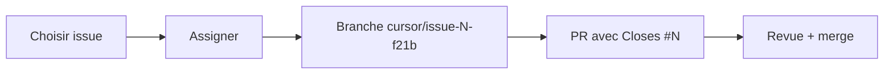

# Guide de délégation — GitHub

Comment utiliser les issues pour déléguer le développement de **Revues**.

## Harness agents (obligatoire)

Avant d'assigner une issue à un agent ou un contributeur :

1. Vérifier que le **harness** est mergé sur `main` ([AGENTS.md](../AGENTS.md))
2. L'agent lit : `AGENTS.md` → issue → `CONVENTIONS.md` → `DEFINITION_OF_DONE.md`
3. Chaque PR doit passer `./scripts/check.sh` et la [checklist PR](../.github/PULL_REQUEST_CHECKLIST.md)
4. Consulter [REVIEW_ADVERSE.md](./REVIEW_ADVERSE.md) pour les pièges connus

```bash
# Prompt agent type
Implémente UNIQUEMENT l'issue #N du repo jeb-maker/revues.
Lis AGENTS.md. ./scripts/check.sh avant push. PR : Closes #N.
```

## Organisation recommandée

### 1. Milestones (à créer manuellement)

| Milestone | Issues |
|-----------|--------|
| **Vague 1 — Cœur métier** | #2 (épique) + #5 à #16 |
| **Vague 2 — Admin & intégrations** | #3 (épique) + #17 à #24 |
| **Vague 3 — Companion & fichiers** | #4 (épique) + #25 à #29 |

Création : *Issues → Milestones → New milestone*

### 2. Labels (à créer manuellement)

```
epic, vague-1, vague-2, vague-3
area:infra, area:data, area:auth, area:core, area:ui
area:admin, area:integrations, area:notifications, area:attachments
good first issue
```

Création : *Issues → Labels → New label*

### 3. Épiques

Chaque vague a une issue `[Epic][Vague N]` qui regroupe les tâches. Utiliser une **task list** GitHub dans le corps de l'épique :

```markdown
- [ ] #3 Bootstrap Go
- [ ] #4 Schéma DB
...
```

Ou le **Projects** board (voir ci-dessous).

---

## Workflow de délégation



1. **Choisir** une issue atomique (1–3 jours de travail)
2. **Assigner** à un humain ou un agent Cloud
3. **Branche** : `cursor/<description>-f21b`
4. **PR** : titre = titre de l'issue, corps = `Closes #N`
5. **Merge** → issue fermée automatiquement

### Parallélisation possible (vague 1)

Après auth (#5–#6), en parallèle :
- Projets (#8) + Modèles (#9)
- Puis convergence sur Lancer revue (#10)

---

## GitHub Projects (optionnel)

Créer un **Project board** « Revues Roadmap » :

| Colonne | Contenu |
|---------|---------|
| Backlog | Issues non priorisées |
| Vague 1 | Issues vague 1 |
| En cours | Assignées |
| Revue | PR ouvertes |
| Terminé | Fermées |

Vue recommandée : **Board** par milestone.

---

## Déléguer à des agents Cloud

Dans le prompt agent, référencer :

```
Implémente l'issue GitHub #N du repo jeb-maker/revues.
Lis docs/PLAN.md pour le contexte.
Critères d'acceptation dans l'issue.
Branche : cursor/<nom>-f21b
PR : Closes #N
```

**Bonnes issues pour agents** : bien définies, critères d'acceptation checklist, périmètre fermé.

| Facile à déléguer | Mieux en binôme |
|-----------------|-----------------|
| Bootstrap Go (#3) | Auth OAuth (#5) |
| Schéma DB (#4) | Jira intégration (#19–#20) |
| HTMX UI (#13) | Lancer revue snapshot (#10) |
| Webhooks (#21) | Modèles versionnés (#9) |

---

## Script de création d'issues

```bash
./scripts/create-github-issues.sh
```

Crée les 28 issues (3 épiques + 25 tâches). Labels et milestones à ajouter manuellement si le token n'a pas les permissions.

---

## Documents de référence

- [AGENTS.md](../AGENTS.md) — contrat agents
- [PLAN.md](./PLAN.md) — vision complète
- [ROADMAP.md](./ROADMAP.md) — dépendances et ordre
- [REVIEW_ADVERSE.md](./REVIEW_ADVERSE.md) — revue critique
- [RBAC.md](./RBAC.md) — permissions
- [DEFINITION_OF_DONE.md](./DEFINITION_OF_DONE.md) — critères merge
- [Issues](https://github.com/jeb-maker/revues/issues)
