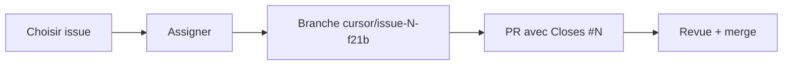

# Guide de délégation — GitHub

Comment utiliser les issues pour déléguer le développement de **Revues**.

## Harness agents (obligatoire)

Avant d'assigner une issue à un agent ou un contributeur :

1. Vérifier que le **harness** est mergé sur `main` ([AGENTS.md](../AGENTS.md))
2. L'agent lit : `AGENTS.md` → issue → `CONVENTIONS.md` → **`GO.md`** → `DEFINITION_OF_DONE.md`
3. Chaque PR doit passer `./scripts/check.sh` et la [checklist PR](../.github/PULL_REQUEST_CHECKLIST.md)
4. Consulter [REVIEW_ADVERSE.md](./REVIEW_ADVERSE.md) pour les pièges connus

```bash
# Prompt agent type
Implémente UNIQUEMENT l'issue #N du repo jeb-maker/revues.
Lis AGENTS.md. ./scripts/check.sh avant push. PR : Closes #N.
```

## Organisation recommandée

### Labels

```
epic, vague-thematic
area:infra, area:data, area:auth, area:core, area:ui
area:admin, area:integrations, area:notifications, area:attachments
good first issue
```

Roadmap thématique : [issues/thematic-roadmap-epic.md](./issues/thematic-roadmap-epic.md) —  
`./scripts/create-thematic-roadmap-issues.sh` (lots 0–5).

### Épiques

Utiliser une **task list** GitHub dans le corps de l'épique, ou un **Projects** board.

---

## Workflow de délégation


```mermaid
flowchart LR
    A[Choisir issue] --> B[Assigner]
    B --> C[Branche cursor/issue-N-f21b]
    C --> D[PR avec Closes #N]
    D --> E[Revue + merge]
```

1. **Choisir** une issue atomique (1–3 jours de travail)
2. **Assigner** à un humain ou un agent Cloud
3. **Branche** : `cursor/<description>-f21b`
4. **PR** : titre = titre de l'issue, corps = `Closes #N`
5. **Merge** → issue fermée automatiquement

---

## Déléguer à des agents Cloud

```
Implémente l'issue GitHub #N du repo jeb-maker/revues.
Lis docs/PLAN.md pour le contexte.
Critères d'acceptation dans l'issue.
Branche : cursor/<nom>-f21b
PR : Closes #N
```

**Bonnes issues pour agents** : bien définies, critères d'acceptation checklist, périmètre fermé.

Revue humaine obligatoire : auth OAuth, `area:integrations`, chiffrement, webhooks.

---

## Documents de référence

- [AGENTS.md](../AGENTS.md) — contrat agents
- [PLAN.md](./PLAN.md) — vision complète
- [ROADMAP.md](./ROADMAP.md) — dépendances et ordre
- [REVIEW_ADVERSE.md](./REVIEW_ADVERSE.md) — pièges connus
- [RBAC.md](./RBAC.md) — permissions
- [DEFINITION_OF_DONE.md](./DEFINITION_OF_DONE.md) — critères merge
- [Issues](https://github.com/jeb-maker/revues/issues)
