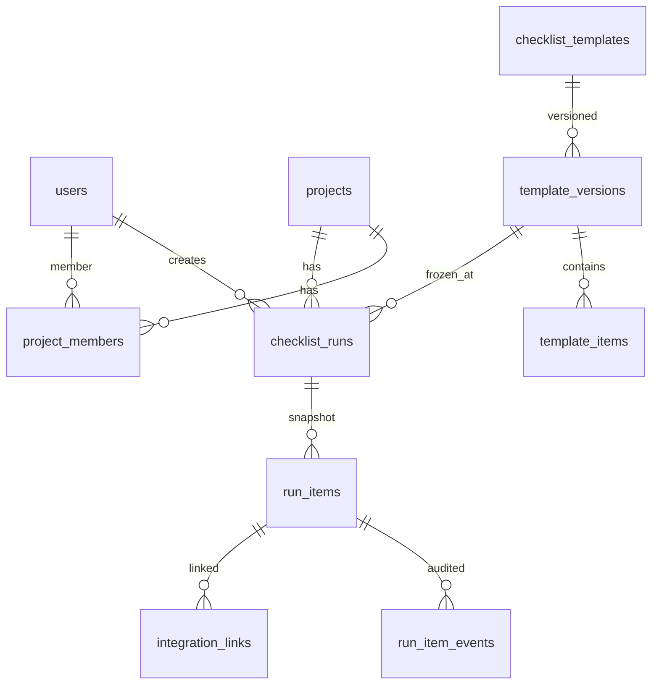

# Revues — Plan produit & technique

Application de gestion de check-lists pour revues de projets.

**Trois piliers** : simple d'utilisation · éco-conçue · riche fonctionnellement.

---

## Vision

> **Revues** exécute et trace les revues ; **Jira** traite les `nok` ; **webhooks** notifient le reste de la stack ; **Notion** archive et documente.

Remplace Excel, fils de mails et check-lists éparpillées, sans devenir une usine à gaz.

---

## Principes directeurs

| Pilier | Concrètement |
|--------|--------------|
| **Simple d'utilisation** | Parcours guidés, vocabulaire clair, progressive disclosure |
| **Éco-conçue** | Rendu serveur, HTMX (pas SPA), SQLite, 1 binaire, appels API à la demande |
| **Riche fonctionnel** | Versionnement, audit, assignation, intégrations, export |

### Budget sobriété

| Métrique | Cible |
|----------|-------|
| HTML par page | < 50 Ko |
| CSS | < 20 Ko |
| JS / HTMX | < 15 Ko |
| Requêtes par page | ≤ 8 |
| RAM serveur | < 128 Mo en charge normale |

---

## Stack technique

```
Go + chi + html/template + HTMX
SQLite (WAL) + goose
OAuth2 GitHub (v1) · Google (v2)
Sessions en base · SMTP configurable
Stockage local (attachments/)
Caddy · 1 binaire · 1 VM
```

### Structure cible

```
revues/
  cmd/revues/main.go
  internal/
    auth/           # OAuth GitHub, sessions, RBAC
    projects/       # projets + membres
    templates/      # modèles versionnés
    runs/           # exécutions + snapshot
    items/          # statuts, commentaires, assignations
    notifications/  # email SMTP
    integrations/   # jira, notion, webhooks
    admin/          # users, settings
    store/          # requêtes SQL
    web/            # handlers, middleware
  migrations/
  web/templates/
  web/static/
  data/attachments/
```

---

## Modèle de données (résumé)



### Tables principales

- `users` — identité GitHub, rôle global (`admin` / `editor` / `reader`)
- `projects` + `project_members` — projets et rôles locaux
- `checklist_templates` → `template_versions` → `template_items` — modèles versionnés
- `checklist_runs` → `run_items` — exécutions (snapshot immuable)
- `run_item_events` — audit des changements de statut
- `integrations` + `integration_links` — config Jira, webhooks, liens externes
- `settings` — SMTP et config chiffrée
- `attachments` — pièces jointes (v1.1)

### Règles métier clés

1. Modifier un modèle = **nouvelle version**, jamais UPDATE destructif sur une version publiée.
2. Lancer une revue = **copie SQL** des items vers `run_items`.
3. Statuts point : `pending` / `ok` / `nok` / `na` — commentaire **obligatoire** si `nok`.
4. Seuls `status`, `comment`, `assigned_to`, `checked_*` sont mutables sur `run_items`.

---

## Rôles & accès

### Rôles globaux

| Rôle | Droits |
|------|--------|
| `reader` | Consulter |
| `editor` | Créer modèles, lancer revues, cocher |
| `admin` | Tout + utilisateurs, SMTP, intégrations |

### Rôles par projet

| Rôle local | Droits |
|------------|--------|
| `lead` | Gérer membres du projet |
| `contributor` | Cocher, commenter |
| `viewer` | Lecture seule sur ce projet |

### Auth

- **GitHub OAuth** en v1 (Authorization Code + PKCE, flux serveur)
- Liste blanche admin (emails ou domaine `@entreprise.com`)
- Sessions cookie `HttpOnly` + `Secure` + `SameSite=Lax`, ID en base
- CSRF sur tous les POST
- Google OAuth en v2

---

## Écrans

1. Connexion (GitHub)
2. Tableau de bord — projets + « Mes tâches »
3. Fiche projet — revues, membres, stats
4. Liste / éditeur modèles (sections + points)
5. Assistant lancement revue (3 étapes)
6. Détail revue — points, progression, activité, Jira
7. Admin — utilisateurs, SMTP, intégrations

---

## Intégrations

### Jira (v1) — Cloud **et** Server / Data Center

| Type instance | Auth |
|---------------|------|
| Jira Cloud | Email + API token Atlassian |
| Jira Server / DC | PAT ou OAuth 2.0 |

Actions :
- Lier une issue (`PROJ-123` ou URL) sur un point
- Créer un ticket depuis un point `nok`
- (v2) Afficher statut issue à l'ouverture de la revue

### Webhooks (v1)

Événements :
- `review.completed` — revue clôturée
- `review.item.nok` — point marqué non conforme

Config : URL(s), secret HMAC, cases à cocher par événement, bouton test.

### Notion (v1.1) — companion, pas remplacement

Notion **ne remplace pas** Revues pour l'exécution des revues (pas d'audit, pas de snapshot, pas de Jira).

| Sens | Action |
|------|--------|
| Revues → Notion | Exporter une revue clôturée (archive doc) |
| Notion → Revues | Importer un modèle depuis une DB Notion |
| Lien | URL Notion sur un projet |

Pas de sync bidirectionnelle temps réel.

### SMTP (v1)

Admin configure : hôte, port, TLS, user, password (chiffré), expéditeur.
Bouton « Envoyer un email de test ».

Emails déclenchés : revue terminée, point assigné, échéance J-1.

---

## Pièces jointes (v1.1)

- Types : JPEG, PNG, WebP, PDF
- Max upload 5 Mo · cible < 500 Ko après compression (images)
- 1 pièce jointe par point
- Compression serveur à l'upload (`imaging` + WebP/JPEG)
- Stockage local `data/attachments/`

---

## Roadmap en 3 vagues

Voir [ROADMAP.md](./ROADMAP.md) et les [issues GitHub](https://github.com/jeb-maker/revues/issues) pour le détail des tâches déléguables.

| Vague | Objectif | Livrable clé |
|-------|----------|--------------|
| **1 — Cœur** | App utilisable sans intégrations | Revues complètes, auth, audit |
| **2 — Admin & intégrations** | Brancher la stack existante | SMTP, Jira, webhooks |
| **3 — Companion** | Archivage & fichiers | Notion, pièces jointes |

---

## Décisions figées

- [x] GitHub OAuth en premier
- [x] Jira Cloud + Server/DC
- [x] Webhooks : `review.completed` + `review.item.nok`
- [x] SMTP configurable par admin
- [x] Notion en companion (export prioritaire, import ensuite)
- [x] Rendu serveur + HTMX, pas de SPA
- [x] SQLite WAL en v1

## Reporté v2+

- Google OAuth
- Sync statut Jira à la demande
- Slack / Teams natif
- PostgreSQL (si multi-instance)

---

## Organisation GitHub pour délégation

Les tâches sont découpées en **épiques** (1 par vague) et **issues** atomiques :

- Chaque issue = livrable testable, 1 à 3 jours max
- Labels `vague-1`, `vague-2`, `vague-3` + `area:*`
- Milestones alignés sur les vagues
- Critères d'acceptation dans chaque issue
- Dépendances indiquées dans le corps (« Bloqué par #X »)

**Workflow délégation** : assigner une issue → branch `cursor/<issue>-f21b` → PR liée à l'issue (`Closes #N`).

---

## Références

- Issues : https://github.com/jeb-maker/revues/issues
- Milestones : https://github.com/jeb-maker/revues/milestones
