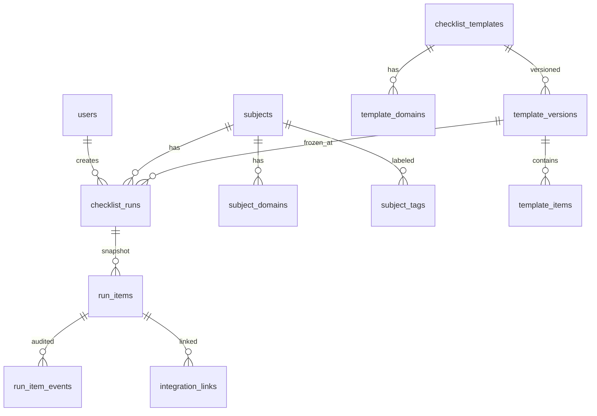

# Revues — Plan produit & technique

Application de gestion de check-lists pour revues qualité.

**Trois piliers** : simple d'utilisation · éco-conçue · riche fonctionnellement.

---

## Vision

> **Revues** exécute et trace les revues ; **Jira** traite les `nok` ; **webhooks** notifient le reste de la stack.

Remplace Excel, fils de mails et check-lists éparpillées, sans devenir une usine à gaz.

---

## Principes directeurs

| Pilier | Concrètement |
|--------|--------------|
| **Simple d'utilisation** | Parcours guidés, vocabulaire clair, progressive disclosure |
| **Éco-conçue** | API sobre + SvelteKit léger + mb, SQLite, 1 binaire, appels API à la demande |
| **Riche fonctionnel** | Versionnement, audit, assignation, intégrations, export |

### Budget sobriété

Stack SPA — seuils appliqués par `./scripts/check.sh` (WP-005). Vendor mb mesuré séparément (hors fail strict jusqu’à WP-030 si resserrage).

| Métrique | Seuil (`check.sh`) |
|----------|--------------------|
| JS **app** `frontend/build/_app/**/*.js` (hors vendor mb) | ≤ **264 KiB** brut · ≤ **112 KiB** gzip-9 |
| CSS **app** `frontend/build/_app/**/*.css` (hors tokens mb) | ≤ **12 KiB** brut · ≤ **4 KiB** gzip-9 |
| Vendor mb `web/static/vendor/jeb-maker-mb/` | mesuré (log) ; **pas de fail** pour l’instant |
| Requêtes API par navigation écran | viser ≤ 8 |
| RAM serveur | < 128 Mo en charge normale |

---

## Stack technique

Décision : [ADR-001-api-first-svelte.md](./ADR-001-api-first-svelte.md).

```
Go + chi + OpenAPI (codegen) + sqlc
SvelteKit (SPA) + @jeb-maker/mb
SQLite (WAL) + goose
OAuth2 GitHub · sessions cookie + CSRF
SMTP · Jira / webhooks
Caddy · 1 binaire · 1 VM
```

### Structure cible

```
revues/
  cmd/revues/main.go
  api/openapi/        # contrat OpenAPI
  frontend/           # SvelteKit + mb
  internal/
    auth/             # OAuth, sessions, CSRF, RBAC
    features/         # services métier (vertical)
    store/            # SQL (sqlc)
    integrations/     # jira, webhooks
    notifications/ attachments/ crypto/ config/
    web/              # router API, middleware, static SPA
  migrations/
  data/attachments/
```

---

## Modèle de données (résumé)


```mermaid
erDiagram
    users ||--o{ checklist_runs : creates
    subjects ||--o{ checklist_runs : has
    subjects ||--o{ subject_domains : has
    subjects ||--o{ subject_tags : labeled
    checklist_templates ||--o{ template_domains : has
    checklist_templates ||--o{ template_versions : versioned
    template_versions ||--o{ template_items : contains
    template_versions ||--o{ checklist_runs : frozen_at
    checklist_runs ||--o{ run_items : snapshot
    run_items ||--o{ run_item_events : audited
    run_items ||--o{ integration_links : linked
```

### Tables principales

- `users` — identité GitHub, rôle global (`admin` / `editor` / `reader`)
- `subjects` + `subject_domains` + `subject_tags` — sujets revus, domaines (matching modèles) et étiquettes descriptives
- `checklist_templates` → `template_versions` → `template_items` — modèles versionnés
- `checklist_runs` → `run_items` — exécutions (snapshot immuable), champ `due_date` optionnel
- `run_item_events` — audit des changements de statut
- `sessions` — sessions serveur (ID aléatoire hashé)
- `allowed_emails` — liste blanche admin
- `integrations` + `integration_links` — config Jira, webhooks, liens externes
- `settings` — SMTP et config chiffrée
- `attachments` — pièces jointes (v1.1)

### Règles métier clés

1. Modifier un modèle = **nouvelle version**, jamais UPDATE destructif sur une version publiée.
2. Lancer une revue = **copie SQL** des items vers `run_items`.
3. Statuts point : `pending` / `ok` / `nok` / `na` — commentaire **obligatoire** si `nok`.
4. Seuls `status`, `comment`, `assigned_to`, `checked_*` sont mutables sur `run_items`.

---

## Rôles & accès

### Rôles globaux

| Rôle | Droits |
|------|--------|
| `reader` | Consulter |
| `editor` | Créer modèles, lancer revues, cocher |
| `admin` | Tout + bypass org (intégrations : aussi org owner/admin) |

### Rôles par projet

| Rôle local | Droits |
|------------|--------|
| `lead` | Gérer membres du projet |
| `contributor` | Cocher, commenter |
| `viewer` | Lecture seule sur ce projet |

### Auth

- **GitHub OAuth** en v1 (Authorization Code + PKCE, flux serveur)
- **Inscription manuelle** (email + mot de passe argon2id) en complément de GitHub
- Liste blanche admin (emails ou domaine `@entreprise.com`) — email GitHub **vérifié** obligatoire ; mêmes règles whitelist pour l'inscription locale
- Sessions cookie `HttpOnly` + `Secure` + `SameSite=Lax`, ID hashé en base, rotation au login
- CSRF sur toutes les mutations API (`X-CSRF-Token`) ; cookie guest pour login/register non authentifiés
- Matrice RBAC : voir [RBAC.md](./RBAC.md)
- Google OAuth en v2

---

## Écrans

1. Connexion (GitHub OAuth et/ou email + mot de passe)
2. Hub **Revues** (`/revues`) — liste paginée, filtres statut, CTA lancement
3. Fiche sujet — revues, collab (équipes/membres si P1+), domaines/étiquettes si multi-sujet
4. Liste / éditeur modèles ou listes (vocabulaire via `ShowSubjectColumn`)
5. Assistant lancement revue (`/revues/nouvelle`) — **2 étapes** (sujet → modèle/liste)
6. Détail revue — points (SvelteKit + mb), progression, Jira/preuve selon capabilities
7. Mes tâches (si ≥2 membres)
8. Admin org — utilisateurs, sujets, SMTP, intégrations, libellés UI

---

## Intégrations

### Jira (v1) — Cloud d'abord

| Type instance | Auth | Statut |
|---------------|------|--------|
| Jira Cloud | Email + API token Atlassian | **Livré** |
| Jira Server / DC | PAT ou OAuth 2.0 | **Icebox** ([#65](https://github.com/jeb-maker/revues/issues/65)) |

Actions (Cloud) :
- Lier une issue (`PROJ-123` ou URL) sur un point
- Créer un ticket depuis un point `nok`
- (v2) Afficher statut issue à l'ouverture de la revue

### Webhooks (v1)

Événements :
- `review.completed` — revue clôturée
- `review.item.nok` — point marqué non conforme

Config : URL(s), secret HMAC-SHA256, `event_id` unique, cases à cocher par événement, bouton test.

**Sécurité** : anti-SSRF (blocklist IP privées, timeout 5s, max 1 redirect). Voir [CONVENTIONS.md](./CONVENTIONS.md).

### Notion — retiré

Intégration Notion **hors périmètre produit** (plus d’API ni d’UI). Voir [NOTION.md](./NOTION.md).

### SMTP (v1)

Admin configure : hôte, port, TLS, user, password (chiffré), expéditeur.
Bouton « Envoyer un email de test ».

Emails déclenchés : revue terminée, point assigné, échéance J-1.

---

## Pièces jointes (v1.1)

- Types : JPEG, PNG, WebP, PDF
- Max upload 5 Mo · cible < 500 Ko après compression (images)
- 1 pièce jointe par point
- Compression serveur à l'upload (`imaging` + WebP/JPEG)
- Stockage local `data/attachments/`

---

## Paliers UI (progressive disclosure)

**Même produit** — complexité révélée par la structure d’usage, pas un mode « lite » forké.  
Détail runtime : `.cursor/skills/revues-ui-audit/decisions.md`.

| Palier | Déclencheur | Surface |
|--------|-------------|---------|
| **P0 — Particulier** | `SimpleUI` (1 org · 1 membre · ≤1 sujet · whitelist ≤1 · pas admin global) | Revues · Listes ; cocher ; CSV ; pas assign / tâches / collab |
| **P1 — Duo** | ≥2 **membres** org | + Assignation · Mes tâches · collab fiche sujet |
| **P2 — Multi-sujet** | ≥2 sujets visibles | + Colonne Sujet · domaines · vocabulaire « Modèles » |
| **P3 — Conformité** | `HasJira` / `HasWebhooks` (config org) · `HasEvidence` (hash scellé, page revue) | Jira/webhooks/preuve **capability-gated** (pas masqués par SimpleUI) |

Principes : unlock don’t fork · vocabulaire suit le palier (Listes → Modèles) · déclencheur structurel (pas de toggle « mode pro ») · P3 indépendant de SimpleUI.

Matrice runtime détaillée : `.cursor/skills/revues-ui-audit/decisions.md` (§ Matrice capability P3).

---

## Roadmap

Vagues 1–3 (cœur, intégrations, companion) et paliers thématiques sont **livrés**.  
Reste et icebox : [ROADMAP.md](./ROADMAP.md). Délégation : [DELEGATION.md](./DELEGATION.md) · [AGENTS.md](../AGENTS.md).

---

## Décisions figées

- [x] GitHub OAuth en premier
- [x] Jira Cloud (Server/DC en icebox #65)

- [x] Webhooks : `review.completed` + `review.item.nok`
- [x] SMTP configurable par admin
- [x] ~~Notion en companion~~ — retiré (hors périmètre)
- [x] SQLite WAL en v1
- [x] Harness agents (AGENTS.md, CI, check.sh) avant code métier
- [x] Schéma canonique : [schema/canonical.sql](./schema/canonical.sql)
- [x] **ADR-001** : API-first Go + SvelteKit + mb (big bang, remplace HTMX/templates)

## Reporté v2+

- Google OAuth
- Jira Server/DC (Cloud d'abord)
- Sync statut Jira à la demande
- Slack / Teams natif
- PostgreSQL (si multi-instance — voir critères ci-dessous)
- Imports atomiques mb par composant (aujourd’hui `mb-boot.js` monolithe Lit ; rebuild documenté dans `web/static/vendor/jeb-maker-mb/README.md`)

## Critères de bascule 1 → N instances

Tant qu’**une seule** VM / process sert le trafic, la stack SQLite + attachments locaux + drain in-process (webhooks + emails) est normative.

Envisager Postgres + stockage objet + worker **seulement** si l’un des seuils suivants est atteint :

| Signal | Seuil indicatif | Action |
|--------|-----------------|--------|
| Deuxième process / HA | Besoin de 2 réplicas app | Postgres (remplace SQLite) + claim durable des queues |
| Contention écriture | `SQLITE_BUSY` récurrent malgré pool/WAL/`busy_timeout` | Postgres |
| Attachments multi-AZ / backup | Besoin hors-VM | Interface storage → objet (S3-compat) |
| Drain multi-instance | 2 process qui drainent la même queue | Row claim (`UPDATE … WHERE state`) ou worker unique |

Ne pas migrer « au cas où ». Icebox jusqu’à signal mesuré.

## Rétention des snapshots (design)

Les `run_items` sont une **copie** au lancement : croissance disque linéaire avec le volume de revues.

Politique cible (à implémenter via issue `area:data` dédiée, **sans** UPDATE destructif sur version de modèle publiée) :

1. **Actif** — revues `draft` / `in_progress` / `completed` récentes : inchangé.
2. **Archive froide** — après N mois (réglage org) : export CSV/preuve ZIP déjà disponibles ; option `archived_at` + purge des pièces jointes binaires (métadonnées / hash conservés).
3. **Pas de soft-delete** des `template_versions` publiées ni réécriture de l’historique `run_item_events`.

Implémentation reportée tant que le disque / une exigence conformité ne le justifie pas.

---

## Organisation GitHub pour délégation

Les tâches sont découpées en **épiques** (1 par vague) et **issues** atomiques :

- Chaque issue = livrable testable, 1 à 3 jours max
- Labels `vague-1`, `vague-2`, `vague-3` + `area:*`
- Milestones alignés sur les vagues
- Critères d'acceptation dans chaque issue
- Dépendances indiquées dans le corps (« Bloqué par #X »)

**Workflow délégation** : assigner une issue → branch `cursor/<issue>-f21b` → PR liée à l'issue (`Closes #N`).

---

## Références

- Issues : https://github.com/jeb-maker/revues/issues
- Milestones : https://github.com/jeb-maker/revues/milestones
