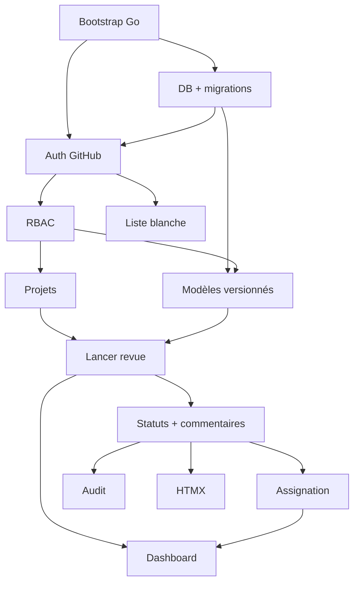

# Roadmap — Revues

Tâches organisées pour délégation via issues GitHub.

## Vague 1 — Cœur métier

**Objectif** : lancer et clôturer une revue complète, avec traçabilité.

| # | Tâche | Area | Dépend de |
|---|-------|------|-----------|
| 1 | Bootstrap projet Go (chi, templates, static, healthz) | infra | — |
| 2 | Schéma DB + migrations goose | data | 1 |
| 3 | Auth GitHub OAuth + sessions + CSRF | auth | 1, 2 |
| 4 | RBAC global + middleware RequireRole | auth | 3 |
| 5 | Admin liste blanche utilisateurs | admin | 3, 4 |
| 6 | CRUD projets + membres + rôles locaux | projects | 4 |
| 7 | Modèles versionnés (templates, sections, items) | templates | 2, 4 |
| 8 | Lancer revue (snapshot SQL des items) | runs | 6, 7 |
| 9 | Détail revue : statuts ok/nok/na + commentaire obligatoire si nok | items | 8 |
| 10 | Assignation par point + « Mes tâches » | items | 9 |
| 11 | Audit trail (run_item_events) | items | 9 |
| 12 | UI HTMX (cocher, commenter sans reload complet) | ui | 9 |
| 13 | Tableau de bord + fiche projet (stats, progression) | ui | 8, 10 |

**Critère de fin de vague** : Marie crée un modèle, Thomas exécute une revue, Sophie consulte l'historique — sans Excel.

---

## Vague 2 — Admin & intégrations

**Objectif** : brancher SMTP, Jira et webhooks.

| # | Tâche | Area | Dépend de |
|---|-------|------|-----------|
| 14 | Écran admin SMTP (config chiffrée + test email) | admin | Vague 1 |
| 15 | Notifications email (revue terminée, assignation, échéance) | notifications | 14 |
| 16 | Config Jira admin (Cloud vs Server/DC, credentials) | integrations | Vague 1 |
| 17 | Jira : lier une issue sur un point | integrations | 16 |
| 18 | Jira : créer ticket depuis point nok | integrations | 16, 17 |
| 19 | Webhooks sortants (review.completed + review.item.nok) | integrations | Vague 1 |
| 20 | Admin intégrations (UI unifiée + tests) | admin | 16, 19 |

**Critère de fin de vague** : un point `nok` crée ou lie un ticket Jira ; la clôture déclenche un webhook et un email.

---

## Vague 3 — Companion & fichiers

**Objectif** : archivage Notion et pièces jointes.

| # | Tâche | Area | Dépend de |
|---|-------|------|-----------|
| 21 | Config Notion admin (token, workspace) | integrations | Vague 1 |
| 22 | Export revue clôturée vers Notion | integrations | 21 |
| 23 | Import modèle depuis DB Notion | integrations | 21, 7 |
| 24 | Upload pièces jointes + compression images | attachments | 9 |
| 25 | Affichage pièces jointes dans détail revue | attachments | 24 |

**Critère de fin de vague** : une revue clôturée est archivée dans Notion ; un point peut avoir une capture compressée.

---

## Graphe de dépendances (vague 1)

---

## Labels GitHub

| Label | Usage |
|-------|-------|
| `epic` | Issue regroupante par vague |
| `vague-1` / `vague-2` / `vague-3` | Priorisation |
| `area:auth` | Authentification |
| `area:core` | Métier revues |
| `area:ui` | Interface |
| `area:admin` | Administration |
| `area:integrations` | Jira, Notion, webhooks |
| `area:data` | Schéma, migrations |
| `good first issue` | Tâches d'entrée (bootstrap, healthz) |

---

## Conseils délégation

1. **Une issue = un PR** — éviter les PR fourre-tout.
2. **Définir les critères d'acceptation** avant de déléguer (déjà dans chaque issue).
3. **Paralléliser** après auth : projets (6) et modèles (7) en parallèle.
4. **Agents / contributeurs** : référencer l'issue dans la branche et le PR (`Closes #N`).
5. **Revue de code** : vérifier RBAC serveur sur chaque nouvelle route.
