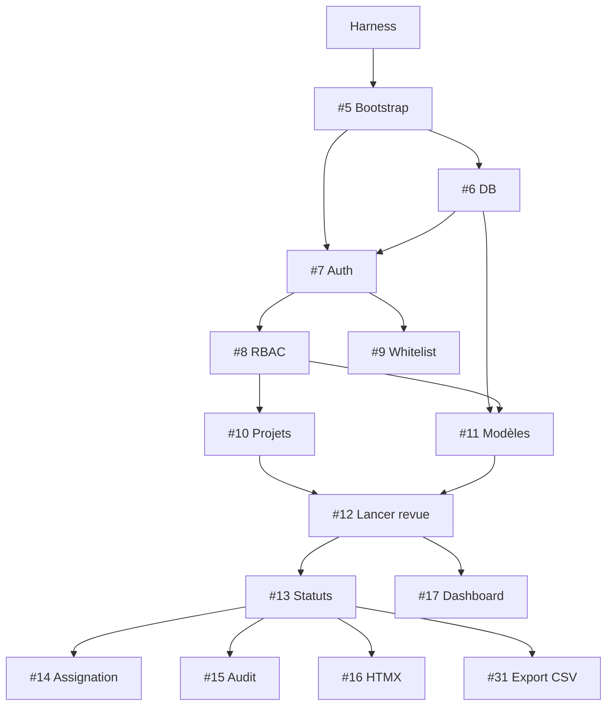

# Roadmap — Revues

Tâches organisées pour délégation via [issues GitHub](https://github.com/jeb-maker/revues/issues).

> **Numérotation** : les numéros `#N` ci-dessous = issues GitHub.  
> **Harness** : lire [AGENTS.md](../AGENTS.md) avant toute issue. `./scripts/check.sh` obligatoire.

---

## Prérequis — Harness (mergé avant #5)

| Fichier | Rôle |
|---------|------|
| `AGENTS.md` | Contrat agents |
| `docs/REVIEW_ADVERSE.md` | Pièges connus |
| `docs/RBAC.md` | Matrice permissions |
| `docs/schema/canonical.sql` | Schéma normatif |
| `scripts/check.sh` + CI | Gate qualité |

---

## Vague 1 — Cœur métier

**Épique** : [#2](https://github.com/jeb-maker/revues/issues/2)

| Issue | Tâche | Area | Dépend de |
|-------|-------|------|-----------|
| [#5](https://github.com/jeb-maker/revues/issues/5) | Bootstrap projet Go | infra | harness |
| [#6](https://github.com/jeb-maker/revues/issues/6) | Schéma DB + migrations goose | data | #5 |
| [#7](https://github.com/jeb-maker/revues/issues/7) | Auth GitHub OAuth + sessions + CSRF | auth | #5, #6 |
| [#8](https://github.com/jeb-maker/revues/issues/8) | RBAC global + middleware | auth | #7 |
| [#9](https://github.com/jeb-maker/revues/issues/9) | Liste blanche utilisateurs | admin | #7, #8 |
| [#10](https://github.com/jeb-maker/revues/issues/10) | CRUD projets + membres | projects | #8 |
| [#11](https://github.com/jeb-maker/revues/issues/11) | Modèles versionnés | templates | #6, #8 |
| [#12](https://github.com/jeb-maker/revues/issues/12) | Lancer revue (snapshot SQL) | runs | #10, #11 |
| [#13](https://github.com/jeb-maker/revues/issues/13) | Statuts ok/nok/na + commentaire nok | items | #12 |
| [#14](https://github.com/jeb-maker/revues/issues/14) | Assignation + Mes tâches | items | #13 |
| [#15](https://github.com/jeb-maker/revues/issues/15) | Audit trail | items | #13 |
| [#16](https://github.com/jeb-maker/revues/issues/16) | UI HTMX | ui | #13 |
| [#17](https://github.com/jeb-maker/revues/issues/17) | Dashboard + fiche projet | ui | #12, #14 |

### Vague 1a — ajouts post-revue adverse

| Issue | Tâche | Area |
|-------|-------|------|
| [#31](https://github.com/jeb-maker/revues/issues/31) | Export CSV revue clôturée | core |
| [#32](https://github.com/jeb-maker/revues/issues/32) | Échéance revue (`due_date`) | core |
| [#34](https://github.com/jeb-maker/revues/issues/34) | Tests RBAC transversaux | auth |

**Critère de fin** : Marie crée un modèle, Thomas exécute une revue, Sophie exporte en CSV — sans Excel.

---

## Vague 2 — Admin & intégrations

**Épique** : [#3](https://github.com/jeb-maker/revues/issues/3)

| Issue | Tâche | Dépend de |
|-------|-------|-----------|
| [#18](https://github.com/jeb-maker/revues/issues/18) | Admin SMTP | vague 1 |
| [#19](https://github.com/jeb-maker/revues/issues/19) | Notifications email | #18 |
| [#20](https://github.com/jeb-maker/revues/issues/20) | Config Jira (Cloud d'abord) | vague 1 |
| [#21](https://github.com/jeb-maker/revues/issues/21) | Jira : lier issue | #20 |
| [#22](https://github.com/jeb-maker/revues/issues/22) | Jira : créer ticket nok | #20, #21 |
| [#23](https://github.com/jeb-maker/revues/issues/23) | Webhooks sortants | vague 1 |
| [#24](https://github.com/jeb-maker/revues/issues/24) | Admin intégrations UI | #18, #23 |

**Infra** : [#33](https://github.com/jeb-maker/revues/issues/33) Backup SQLite + doc restauration

---

## Vague 3 — Companion & fichiers

**Épique** : [#4](https://github.com/jeb-maker/revues/issues/4)

| Issue | Tâche |
|-------|-------|
| [#25](https://github.com/jeb-maker/revues/issues/25) | Config Notion |
| [#26](https://github.com/jeb-maker/revues/issues/26) | Export revue → Notion |
| [#27](https://github.com/jeb-maker/revues/issues/27) | Import modèle Notion |
| [#28](https://github.com/jeb-maker/revues/issues/28) | Upload pièces jointes |
| [#29](https://github.com/jeb-maker/revues/issues/29) | Affichage pièces jointes |

---

## Graphe de dépendances (vague 1)

---

## Labels GitHub

Voir [DELEGATION.md](./DELEGATION.md).

---

## Conseils délégation

1. Lire **AGENTS.md** avant chaque issue
2. **Une issue = un PR** — `./scripts/check.sh` vert
3. Paralléliser après #8 : #10 et #11
4. **Revue humaine** obligatoire sur #7 et `area:integrations`
5. Référencer [RBAC.md](./RBAC.md) et [canonical.sql](./schema/canonical.sql) dans chaque PR data/auth
