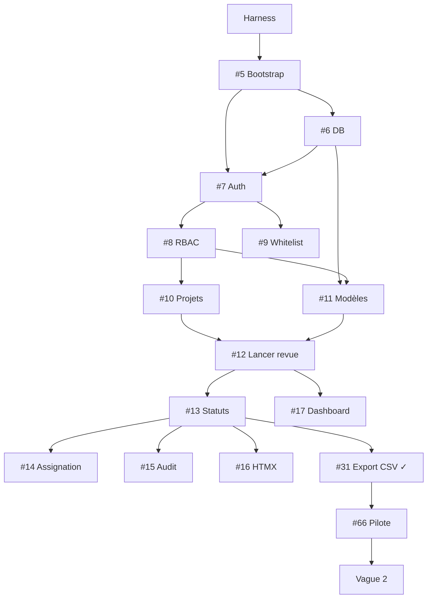
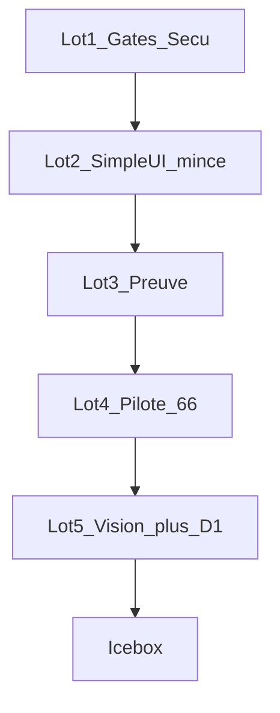

# Roadmap — Revues

Tâches organisées pour délégation via [issues GitHub](https://github.com/jeb-maker/revues/issues).

> **Numérotation** : les numéros `#N` ci-dessous = issues GitHub.  
> **Harness** : lire [AGENTS.md](../AGENTS.md) avant toute issue. `./scripts/check.sh` obligatoire.

---

## Prérequis — Harness (mergé avant #5)

| Fichier | Rôle |
|---------|------|
| `AGENTS.md` | Contrat agents |
| `docs/REVIEW_ADVERSE.md` | Pièges connus |
| `docs/RBAC.md` | Matrice permissions |
| `docs/schema/canonical.sql` | Schéma normatif |
| `scripts/check.sh` + CI | Gate qualité |

---

## Vague 1 — Cœur métier

**Épique** : [#2](https://github.com/jeb-maker/revues/issues/2)

| Issue | Tâche | Area | Dépend de |
|-------|-------|------|-----------|
| [#5](https://github.com/jeb-maker/revues/issues/5) | Bootstrap projet Go | infra | harness |
| [#6](https://github.com/jeb-maker/revues/issues/6) | Schéma DB + migrations goose | data | #5 |
| [#7](https://github.com/jeb-maker/revues/issues/7) | Auth GitHub OAuth + sessions + CSRF | auth | #5, #6 |
| [#8](https://github.com/jeb-maker/revues/issues/8) | RBAC global + middleware | auth | #7 |
| [#9](https://github.com/jeb-maker/revues/issues/9) | Liste blanche utilisateurs | admin | #7, #8 |
| [#10](https://github.com/jeb-maker/revues/issues/10) | CRUD projets + membres | projects | #8 |
| [#11](https://github.com/jeb-maker/revues/issues/11) | Modèles versionnés | templates | #6, #8 |
| [#12](https://github.com/jeb-maker/revues/issues/12) | Lancer revue (snapshot SQL) | runs | #10, #11 |
| [#13](https://github.com/jeb-maker/revues/issues/13) | Statuts ok/nok/na + commentaire nok | items | #12 |
| [#14](https://github.com/jeb-maker/revues/issues/14) | Assignation + Mes tâches | items | #13 |
| [#15](https://github.com/jeb-maker/revues/issues/15) | Audit trail | items | #13 |
| [#16](https://github.com/jeb-maker/revues/issues/16) | UI HTMX | ui | #13 |
| [#17](https://github.com/jeb-maker/revues/issues/17) | Dashboard + fiche projet | ui | #12, #14 |

### Vague 1a — ajouts post-revue adverse

| Issue | Tâche | Area | Statut |
|-------|-------|------|--------|
| [#31](https://github.com/jeb-maker/revues/issues/31) | Export CSV revue clôturée | core | ✓ mergé |
| [#32](https://github.com/jeb-maker/revues/issues/32) | Échéance revue (`due_date`) | core | ✓ mergé |
| [#33](https://github.com/jeb-maker/revues/issues/33) | Backup SQLite + doc restauration | infra | ✓ mergé |
| [#34](https://github.com/jeb-maker/revues/issues/34) | Tests RBAC transversaux | auth | ✓ mergé |
| [#62](https://github.com/jeb-maker/revues/issues/62) | Tests OAuth GitHub mockés | auth | ouvert |
| [#63](https://github.com/jeb-maker/revues/issues/63) | Onboarding et états vides | ui | ouvert |
| [#64](https://github.com/jeb-maker/revues/issues/64) | Centraliser deps handlers (CSRF) | core | ouvert |
| [#66](https://github.com/jeb-maker/revues/issues/66) | Valider parcours pilote vague 1a | meta | ouvert |

**Critère de fin** : Marie crée un modèle, Thomas exécute une revue, Sophie exporte en CSV — sans Excel.

> **Gate vague 2** : ne pas démarrer #19–#24 tant que #66 (parcours pilote) n'est pas PASS.

---

## Vague 2 — Admin & intégrations

**Épique** : [#3](https://github.com/jeb-maker/revues/issues/3)

| Issue | Tâche | Dépend de |
|-------|-------|-----------|
| [#18](https://github.com/jeb-maker/revues/issues/18) | Admin SMTP | vague 1 |
| [#19](https://github.com/jeb-maker/revues/issues/19) | Notifications email | #18 |
| [#20](https://github.com/jeb-maker/revues/issues/20) | Config Jira Cloud | vague 1a (#66) |
| [#65](https://github.com/jeb-maker/revues/issues/65) | Jira Server/DC (icebox) | après #20–#22 |
| [#21](https://github.com/jeb-maker/revues/issues/21) | Jira : lier issue | #20 |
| [#22](https://github.com/jeb-maker/revues/issues/22) | Jira : créer ticket nok | #20, #21 |
| [#23](https://github.com/jeb-maker/revues/issues/23) | Webhooks sortants | vague 1 |
| [#24](https://github.com/jeb-maker/revues/issues/24) | Admin intégrations UI | #18, #23 |

**Infra** : [#33](https://github.com/jeb-maker/revues/issues/33) Backup SQLite ✓

---

## Vague 3 — Companion & fichiers

**Épique** : [#4](https://github.com/jeb-maker/revues/issues/4)

| Issue | Tâche |
|-------|-------|
| [#25](https://github.com/jeb-maker/revues/issues/25) | Config Notion |
| [#26](https://github.com/jeb-maker/revues/issues/26) | Export revue → Notion |
| [#27](https://github.com/jeb-maker/revues/issues/27) | Import modèle Notion |
| [#28](https://github.com/jeb-maker/revues/issues/28) | Upload pièces jointes |
| [#29](https://github.com/jeb-maker/revues/issues/29) | Affichage pièces jointes |

---

## Graphe de dépendances (vague 1)

---

## Vagues thématiques post-cœur

Spec normative : [issues/thematic-roadmap-epic.md](./issues/thematic-roadmap-epic.md).  
Création GitHub : `./scripts/create-thematic-roadmap-issues.sh` (lots 0–5).

Chemin critique : **gates sécu → SimpleUI mince → preuve → #66 PASS → D1 + vision légère → filtres gated**.

### Épiques

| Vague | Épique |
|-------|--------|
| A Adoption | [#184](https://github.com/jeb-maker/revues/issues/184) |
| B SimpleUI | [#185](https://github.com/jeb-maker/revues/issues/185) |
| C Preuve | [#186](https://github.com/jeb-maker/revues/issues/186) |
| D Opérationnel | [#187](https://github.com/jeb-maker/revues/issues/187) |
| E Intégrations v2 | [#188](https://github.com/jeb-maker/revues/issues/188) |
| F Gouvernance (icebox) | [#189](https://github.com/jeb-maker/revues/issues/189) |
| G Hardening | [#190](https://github.com/jeb-maker/revues/issues/190) |

### Lots

| Lot | Issues | Notes |
|-----|--------|-------|
| **1** Gates | [#62](https://github.com/jeb-maker/revues/issues/62) A4 · [#64](https://github.com/jeb-maker/revues/issues/64) A5 · [#191](https://github.com/jeb-maker/revues/issues/191) A2 · [#192](https://github.com/jeb-maker/revues/issues/192) G2 | Avant intégrations |
| **2** SimpleUI | [#193](https://github.com/jeb-maker/revues/issues/193)–[#201](https://github.com/jeb-maker/revues/issues/201) (B1→B2→B3→B0→B5→B6→A1a/b/c) | Séquentiel templates ; #63 scindé |
| **3** Preuve | [#202](https://github.com/jeb-maker/revues/issues/202)–[#205](https://github.com/jeb-maker/revues/issues/205) (C0–C3) | C1 WIP branche evidence |
| **4** Pilote | [#66](https://github.com/jeb-maker/revues/issues/66) (+ checklist terrain) | Humain, pas agent code |
| **5** Post-#66 | [#206](https://github.com/jeb-maker/revues/issues/206) D1 · [#207](https://github.com/jeb-maker/revues/issues/207) D6 · [#208](https://github.com/jeb-maker/revues/issues/208) E3' · [#209](https://github.com/jeb-maker/revues/issues/209) E6 · [#210](https://github.com/jeb-maker/revues/issues/210)–[#212](https://github.com/jeb-maker/revues/issues/212) B4 · [#213](https://github.com/jeb-maker/revues/issues/213) D7 | Après #66 PASS |

**Icebox** (pas d’issues tant que signal d’usage) : séries/campagnes moteurs, fusion sujets, rapport org, Slack/Teams, Google OAuth, Jira Server, gouvernance F*, audit admin, concurrency items, antivirus, PostgreSQL.

Paliers UI (P0–P3) : voir [PLAN.md](./PLAN.md) ([#197](https://github.com/jeb-maker/revues/issues/197) B5) et `.cursor/skills/revues-ui-audit/decisions.md`.

---

## Labels GitHub

Voir [DELEGATION.md](./DELEGATION.md). Label roadmap : `vague-thematic`.

---

## Conseils délégation

1. Lire **AGENTS.md** avant chaque issue
2. **Une issue = un PR** — `./scripts/check.sh` vert
3. Paralléliser après #8 : #10 et #11
4. **Revue humaine** obligatoire sur #7 et `area:integrations`
5. Référencer [RBAC.md](./RBAC.md) et [canonical.sql](./schema/canonical.sql) dans chaque PR data/auth
6. Roadmap thématique : 1 lot à la fois ; ne pas paralléliser A1↔B*, C1↔C2↔C3 ; Definition of Eco sur issues UI/intégrations
