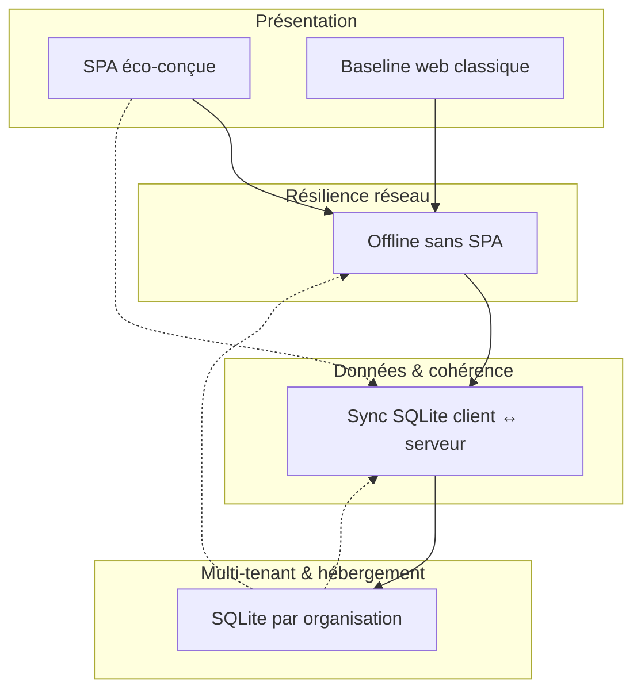

# Carte des couplages entre pistes

Les quatre idées ne sont pas indépendantes. Ce document sert à noter **synergies**, **frictions** et **indépendance** — sans décider.

---

## Schéma global

---

## Matrice de couplage

Légende : **Forte** = l'une conditionne fortement l'autre · **Moyenne** · **Faible** · **Aucune**

|  | SPA éco | Offline sans SPA | Sync SQLite | DB / org |
|--|---------|------------------|-------------|----------|
| **SPA éco** | — | ? | ? | ? |
| **Offline sans SPA** | ? | — | ? | ? |
| **Sync SQLite** | ? | ? | — | ? |
| **DB / org** | ? | ? | ? | — |

*(Remplir en atelier)*

---

## Combinaisons à explorer

### A — Offline sans SPA + outbox HTTP (sans sync SQLite complète)

| Aspect | Notes atelier |
|--------|---------------|
| Idée | Pages cache + file d'attente de POST ; pas de moteur SQL côté client |
| Synergie avec | Baseline web, DB unique ou DB/org |
| Friction avec | Sync bidirectionnelle, conflits multi-appareils |
| Questions | |

### B — SPA éco + état local + sync partielle

| Aspect | Notes atelier |
|--------|---------------|
| Idée | Shell client, API delta, résolution conflits côté serveur |
| Synergie avec | Sync SQLite ou protocole métier léger |
| Friction avec | Budget JS/WASM, complexité sécurité |
| Questions | |

### C — Sync SQLite + même schéma client/serveur

| Aspect | Notes atelier |
|--------|---------------|
| Idée | Répliquer un sous-ensemble de tables par revue ou par org |
| Synergie avec | DB/org (un fichier = un artefact syncable ?) |
| Friction avec | Migrations doubles, fuite de données si export .db |
| Questions | |

### D — DB/org serveur + pack offline exportable

| Aspect | Notes atelier |
|--------|---------------|
| Idée | Télécharger un bundle (HTML + JSON ou .db) pour une revue ; pas de sync temps réel |
| Synergie avec | Offline lecture/écriture limitée, conformité |
| Friction avec | Pas de collaboration temps réel offline |
| Questions | |

### E — Tout sauf SPA : HTMX + Service Worker + outbox

| Aspect | Notes atelier |
|--------|---------------|
| Idée | Rester sur rendu serveur, ajouter couches réseau |
| Synergie avec | Sobriété, ops simples |
| Friction avec | UX fragmentée, cache pages personnalisées |
| Questions | |

---

## Exclusions mutuelles (hypothèses à valider)

| Paire | S'excluent ? | Commentaire atelier |
|-------|--------------|---------------------|
| SPA lourde + budget éco strict | ? | |
| Sync temps réel + audit strict sans conflits | ? | |
| DB/org + utilisateur multi-org fluide | ? | |
| Offline long + CSRF session courte | ? | |
| sql.js WASM + contrainte JS minimale | ? | |

---

## Ordre logique d'étude (pas ordre d'implémentation)

1. **Scénarios offline** → niveau L0–L4 requis
2. **Sync ou pas** → dépend du niveau offline et du multi-utilisateur
3. **DB / org** → dimension isolation / conformité / ops
4. **SPA ou non** → choix présentation une fois contraintes connues

---

## Notes libres

-
