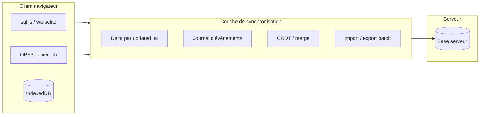

# Fiche 03 — Synchronisation SQLite navigateur ↔ serveur

**Statut** : exploration · **Décision** : aucune · **Code** : aucun

---

## Définition

Maintenir une **copie locale** des données (idéalement relationnelle, SQLite ou équivalent) dans le navigateur, et la **réconcilier** avec la base SQLite (ou autre) du serveur — en continu ou par batch.

---

## Schéma conceptuel

---

## Options SQLite (ou équivalent) côté navigateur

| Technologie | Persistance | Notes |
|-------------|-------------|-------|
| **sql.js** | Mémoire ou export blob | WASM ~1 Mo+, RAM |
| **wa-sqlite + OPFS** | Fichier persistant | Performances correctes, support navigateur à vérifier |
| **IndexedDB seul** | Clé-valeur / objets | Pas SQL, plus léger, requêtes limitées |
| **Aucun moteur SQL** | Outbox JSON par mutation | Plus simple, pas vraiment « sync SQLite » |

---

## Modèles de synchronisation

| Modèle | Principe | Conflits | Complexité |
|--------|----------|----------|------------|
| **Last-write-wins** | Timestamp le plus récent gagne | Perte silencieuse possible | Faible |
| **Delta par table** | `updated_at` / version ligne | Détection simple | Moyenne |
| **Event sourcing** | Seuls les événements voyagent | Rejeu, ordre | Élevée |
| **CRDT** | Fusion algébrique | Dépend du type de donnée | Élevée |
| **Lock pessimiste** | Revue « check-out » par device | Pas de parallèle | Faible, UX rigide |
| **Batch import/export** | Pas de sync live | Aucun (manuel) | Très faible |

---

## Granularité de sync (à trancher plus tard)

| Périmètre | Avantages | Inconvénients |
|-----------|-----------|---------------|
| Par **revue** | Petit volume, clair métier | Multi-revue = multi-sync |
| Par **projet** | Cohérence modèles + revues | Plus lourd |
| Par **organisation** | Aligné tenant | Gros volume, secrets |
| **Schéma complet** | Simple conceptuellement | Invraisemblable côté client |

---

## Données métier « revues » — points d'attention

| Concept | Implication sync |
|---------|------------------|
| **Snapshot revue** | Figé à la création — surtout `run_items` mutables |
| **Statuts point** | `pending` / `ok` / `nok` / `na` — règles métier (commentaire si `nok`) |
| **Audit trail** | Chaque changement = événement ordonné à rejouer |
| **Assignation** | Référence utilisateur — sync ou lecture seule online ? |
| **Intégrations** (Jira, webhooks) | Probablement **online only** |
| **Pièces jointes** | Binaires hors SQL ou blob séparé |

---

## Matrice sync : quand quel modèle ?

| Besoin | Sync temps réel | Outbox HTTP | Export / import batch |
|--------|-----------------|-------------|----------------------|
| Offline écriture | Oui | Oui | Oui (différé) |
| Multi-utilisateur live | Conflits fréquents | Conflits au sync | N/A |
| Audit strict | Difficile | Moyen | Fort |
| Taille client minimale | Non (WASM) | Oui | Oui |
| Complexité dev | Très haute | Moyenne | Basse |

---

## Solutions tierces (étude marché possible, hors code)

À mentionner en atelier sans les évaluer techniquement ici :

- ElectricSQL, PowerSync, Triplit, RxDB + réplication
- litefs, rqlite (plutôt serveur)
- Protocoles génériques : CouchDB replication, automerge

**Question** : sync **générique** vs protocole **métier** (API « cocher point » idempotente) ?

---

## Lien avec les autres fiches

| Fiche | Lien |
|-------|------|
| [01 SPA éco](./01-spa-eco.md) | État client + moteur SQL cohérents avec shell SPA |
| [02 Offline](./02-offline-sans-spa.md) | Sync = souvent le moteur de L2+ offline |
| [04 DB / org](./04-sqlite-par-organisation.md) | Un fichier .db par org côté serveur **répliquable** côté client ? Risque fuite |

---

## Scénarios [scenarios.md](../scenarios.md) — notes atelier

| Scénario | Sync nécessaire ou alternative ? | Modèle plausible | Notes |
|----------|----------------------------------|------------------|-------|
| S1 Zone blanche | | | |
| S2 Gros modèle | | | |
| S3 Multi-org | | | |
| S4 Restauration | | | |
| S5 Conflit offline | | | |
| S6 Export auditeur | | | |
| S7 Onboarding | | | |

---

## Risques majeurs

- **Migrations** : schéma client et serveur doivent évoluer ensemble
- **Sécurité** : une DB locale = export des données sensibles sur device
- **WASM** : poids et RAM contradictoires avec éco-conception stricte
- **Conflits** : métier mal défini → perte de confiance utilisateur
- **Testabilité** : combinaisons online/offline/conflit explosent

---

## À documenter en atelier

- [ ] Sync continue vs bouton « Synchroniser »
- [ ] Même schéma SQL des deux côtés : oui / non / sous-ensemble
- [ ] Règle de conflit pour un point `nok` (S5)
- [ ] Alternative « outbox métier » sans SQLite WASM — suffisante ?

---

## Notes libres

-
