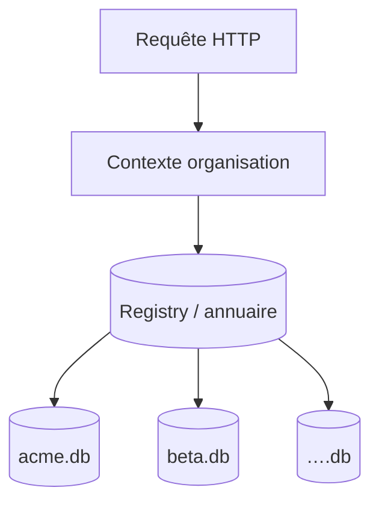

# Fiche 04 — Une base SQLite par organisation

**Statut** : exploration · **Décision** : aucune · **Code** : aucun

---

## Définition

Au lieu d'une **base unique** contenant toutes les organisations (séparation logique par clé `organization_id`), chaque organisation dispose de son **propre fichier** SQLite (ex. `data/orgs/acme.db`, `data/orgs/beta.db`).

Le serveur route chaque requête vers la bonne base selon le contexte tenant.

---

## Spectre multi-tenant (où se situe cette piste)

```
Modèle A ─ DB unique, colonne tenant_id sur chaque table
Modèle B ─ DB unique, schémas séparés (style PostgreSQL search_path)
Modèle C ─ Fichier SQLite par organisation          ← cette fiche
Modèle D ─ Instance / VM par gros client (1 binaire, 1 DB)
```

---

## Architecture conceptuelle



### Variante hybride fréquente

| Composant | Emplacement | Contenu |
|-----------|-------------|---------|
| **Registry** | DB centrale ou config | `users`, `sessions`, mapping `user_id` → orgs, chemins fichiers |
| **Métier** | Fichier par org | `projects`, `runs`, `run_items`, `templates`, … |

---

## Avantages hypothétiques

| Dimension | Effet attendu |
|-----------|---------------|
| **Isolation** | Fuite cross-tenant plus difficile qu'un `WHERE` oublié |
| **Backup / restore** | Par client, aligné contrat / RGPD |
| **Effacement** | Supprimer org = supprimer fichier (+ attachments) |
| **Quotas** | Taille disque par fichier |
| **Performance** | Petites DB → requêtes rapides (jusqu'à un certain seuil) |
| **Portabilité** | « Votre fichier .db » comme livrable |
| **Sharding** | Répartir fichiers sur disques / nœuds |

---

## Inconvénients et coûts hypothétiques

| Dimension | Effet attendu |
|-----------|---------------|
| **Migrations** | Appliquer N fois (ou orchestration par lot) |
| **Connexions** | Pool par DB vs une connexion — limites OS |
| **Requêtes globales** | Stats admin, facturation, support cross-org |
| **Utilisateur multi-org** | Jointure impossible en SQLite pur entre fichiers |
| **Transactions cross-org** | Invitations, partage — complexité |
| **Milliers d'orgs** | Gestion fichiers, backups, monitoring |
| **Cohérence code** | Abstraction « ouvrir la bonne DB » partout |

---

## Utilisateur membre de N organisations

Cas à simuler (voir S3) :

| Approche | Idée |
|----------|------|
| **Connexion par requête** | Ouvrir uniquement la DB de l'org active |
| **Pool limité** | Cache de N connexions récentes |
| **Switch org** | Fermer / ouvrir autre fichier — latence ? |
| **Données offline** | N caches ou un cache par org — stockage client |

---

## Opérations

| Tâche | DB unique | DB par org |
|-------|-----------|------------|
| Migration goose | 1× | N× (parallélisable) |
| Backup nocturne | 1 dump | N dumps ou rsync répertoire |
| Restore client | Restauration partielle complexe | Restauration fichier ciblée |
| Monitoring taille | 1 métrique | Agrégation |
| Test local dev | 1 fichier | Plusieurs fichiers de fixture |

---

## Conformité & juridique (questions, pas réponses)

- Un client exige-t-il contractuellement une **séparation physique** ?
- Export `.db` brut au client : acceptable ?
- Localisation données (région) : un fichier par org facilite-t-il le geo-sharding ?

---

## Variantes et paliers

| Variante | Description |
|----------|-------------|
| **Tiering** | Petits clients en DB partagée ; gros clients en DB dédiée |
| **DB dédiée + registry central** | Compromis courant |
| **Réplication** | litefs / copie read replica par org (infra avancée) |

---

## Lien avec les autres fiches

| Fiche | Lien |
|-------|------|
| [03 Sync SQLite](./03-sync-sqlite.md) | Un fichier org = artefact syncable vers client ? Risque exfiltration |
| [02 Offline](./02-offline-sans-spa.md) | Pack offline pourrait **être** le .db de la revue ou de l'org |
| [01 SPA](./01-spa-eco.md) | Peu de lien direct |

---

## Scénarios [scenarios.md](../scenarios.md) — notes atelier

| Scénario | Impact DB/org | Notes |
|----------|---------------|-------|
| S1 Zone blanche | | |
| S2 Gros modèle | | |
| S3 Multi-org | | |
| S4 Restauration | | |
| S5 Conflit offline | | |
| S6 Export auditeur | | |
| S7 Onboarding | | |

---

## Seuils à estimer (ordres de grandeur)

| Paramètre | Valeur atelier | Impact |
|-----------|----------------|--------|
| Nombre d'organisations | | |
| Taille médiane DB / org | | |
| Taille max DB / org | | |
| % utilisateurs multi-org | | |
| Fréquence migrations / an | | |

---

## À documenter en atelier

- [ ] Isolation physique : exigence réelle ou préférence ?
- [ ] Registry central : quelles tables restent globales ?
- [ ] Multi-org : expérience switch acceptable ?
- [ ] Seuil de bascule vers autre stratégie (tiering, autre moteur) ?

---

## Notes libres

-
