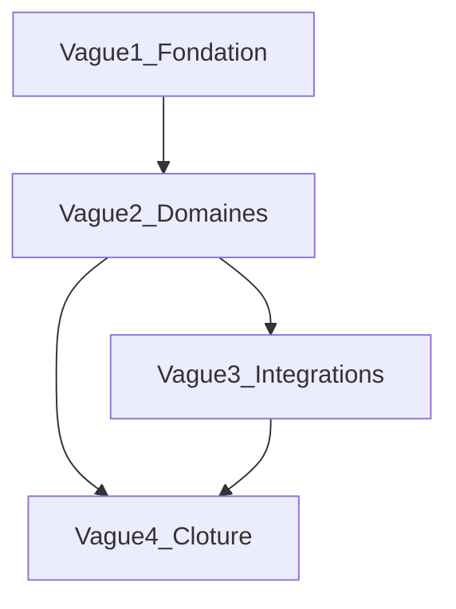

# Rewrite API-first + SvelteKit — orchestration agents

Big bang : remplacer Go templates/HTMX par **Go OpenAPI + SvelteKit + mb**.  
Décision : [ADR-001](../ADR-001-api-first-svelte.md) · Lots détaillés : [WORK_PACKAGES.md](./WORK_PACKAGES.md).

## Règles d’orchestration

1. **1 WP = 1 issue GitHub = 1 PR** — jamais fusionner deux WP.
2. Respecter les **vagues** (dépendances). Au sein d’une vague, paralléliser.
3. Lire `AGENTS.md` + l’issue + [API.md](../API.md) / [FRONTEND.md](../FRONTEND.md) selon le lot.
4. Ambiguïté → commenter l’issue, ne pas inventer le contrat OpenAPI d’un autre domaine.
5. Revue humaine : auth OAuth, intégrations, chiffrement, webhooks (inchangé).

## Vagues



| Vague | WP | Parallèle ? |
|-------|-----|-------------|
| **1 — Fondation** | WP-001 → WP-005 | **Séquentiel** (ordre strict) |
| **2 — Domaines** | WP-010 → WP-016 | **Oui** après WP-005 |
| **3 — Intégrations** | WP-020 → WP-022 | **Oui** après WP-005 ; revue humaine |
| **4 — Clôture** | WP-030 | Après vagues 2–3 utiles |

## Créer les issues GitHub

```bash
./scripts/create-rewrite-issues.sh
```

Nécessite `gh` authentifié avec droit d’écriture issues. Le script crée les issues depuis [WORK_PACKAGES.md](./WORK_PACKAGES.md) (sections `## WP-xxx`) et affiche le mapping WP → `#N`.

Sans script : copier chaque section WP vers une issue (template `.github/ISSUE_TEMPLATE/task.md`), labels indiqués.

## Prompt type agent

```
Repo jeb-maker/revues. Implémente UNIQUEMENT l'issue #N (rewrite API+Svelte).
Lis AGENTS.md, docs/ADR-001-api-first-svelte.md, docs/rewrite/WORK_PACKAGES.md (ton WP),
docs/API.md, docs/FRONTEND.md, docs/DEFINITION_OF_DONE.md.
Si RBAC : docs/RBAC.md. Si données : docs/schema/canonical.sql.
Branche cursor/issue-N-<slug>-f21b. PR titre = titre issue, corps Closes #N.
./scripts/check.sh doit passer. Big bang : ne pas conserver HTMX/templates pour le scope du WP.
```

## Hors rewrite (ne pas mélanger)

- Features produit icebox (Slack, PostgreSQL, …) — [ROADMAP.md](../ROADMAP.md)
- Refactor schéma sauf besoin bloquant d’un WP `area:data`
